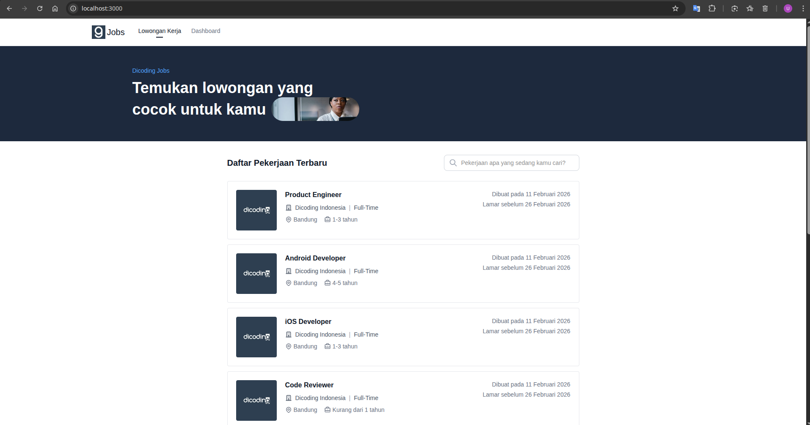
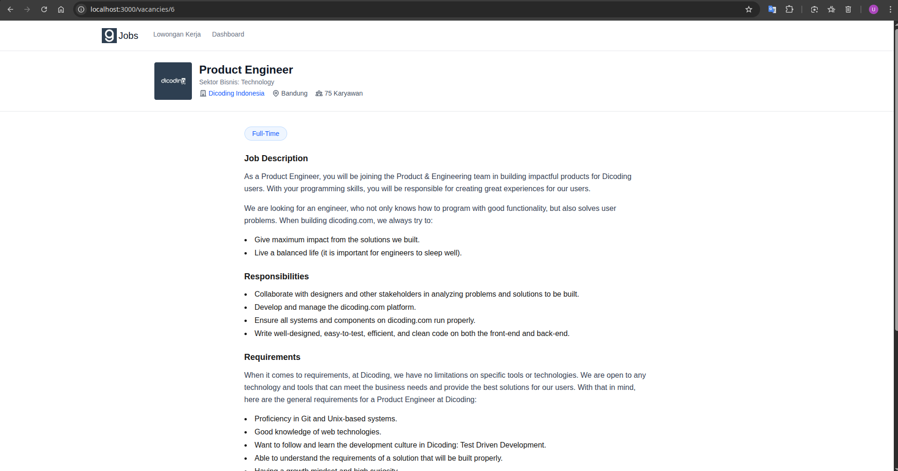
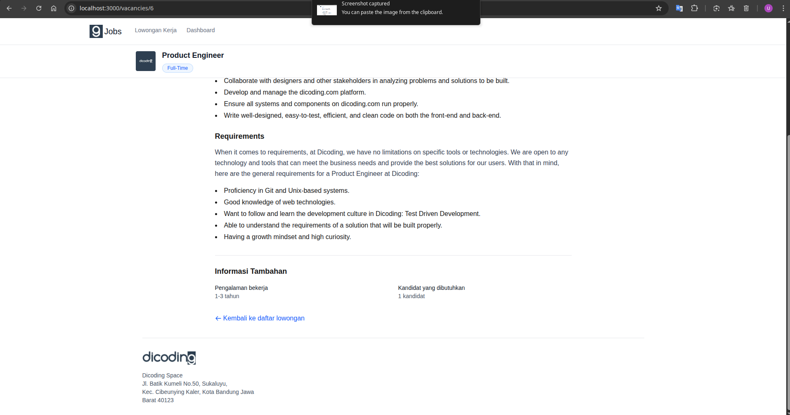
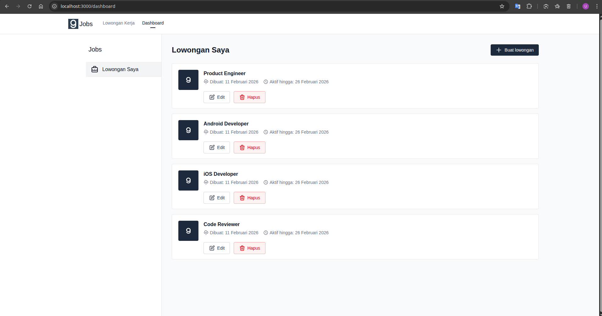
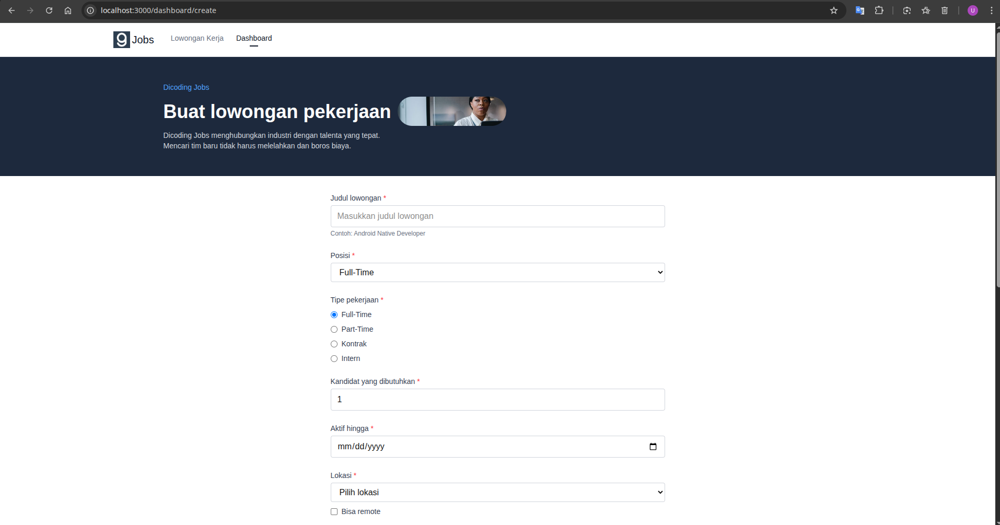
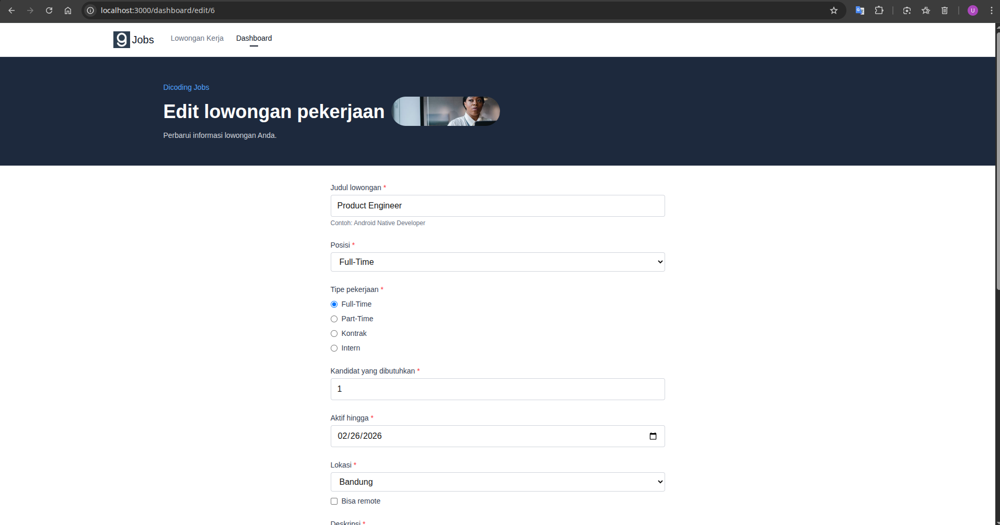

[View Screenshots](#screenshots)

## Quick Start with Docker

```bash
cd dicoding-test

docker-compose up -d

# Wait ~30 seconds for MySQL to initialize and migrations to run
# Then open http://localhost:3000 in your browser
```

**Services:**
- Frontend: http://localhost:3000
- Backend API: http://localhost:8000/api
- MySQL: localhost:3307

**Stop services:**
```bash
docker-compose down
```

---

## Manual Setup

### Prerequisites

- PHP 8.3+
- Composer
- Node.js 20+
- MySQL 8.0+

### 1. Backend Setup (Laravel)

```bash
cd backend

composer install

cp .env.example .env

php artisan key:generate

# Configure database in .env
# DB_CONNECTION=mysql
# DB_HOST=127.0.0.1
# DB_PORT=3306
# DB_DATABASE=dicoding_jobs
# DB_USERNAME=your_username
# DB_PASSWORD=your_password

# Create database
mysql -u root -p -e "CREATE DATABASE dicoding_jobs;"

php artisan migrate

php artisan db:seed

php artisan serve --host=0.0.0.0 --port=8000
```

Backend will be available at: http://localhost:8000

### 2. Frontend Setup (Next.js)

```bash
# Navigate to frontend directory (in a new terminal)
cd frontend

npm install

echo "NEXT_PUBLIC_API_URL=http://localhost:8000/api" > .env.local

npm run dev
```

Frontend will be available at: http://localhost:3000

---

## Running Tests

### Backend Tests

```bash
cd backend

php artisan test

# Run specific test file
php artisan test tests/Unit/VacancyTest.php
php artisan test tests/Feature/VacancyApiTest.php

# Run with coverage (requires Xdebug)
php artisan test --coverage
```

**Example Output:**
```
   PASS  Tests\Unit\VacancyTest
  ✓ vacancy has fillable attributes                                      0.23s
  ✓ vacancy casts expired at to date                                     0.02s
  ✓ vacancy casts is remote to boolean                                   0.01s
  ✓ vacancy is expired returns true for past date                        0.01s
  ✓ vacancy is expired returns false for future date                     0.01s
  ✓ vacancy search scope filters by title                                0.01s
  ✓ vacancy search scope returns all when empty                          0.01s
  ✓ vacancy search scope returns all when null                           0.01s

   PASS  Tests\Feature\VacancyApiTest
  ✓ can get all vacancies                                                0.02s
  ✓ can search vacancies by title                                        0.01s
  ✓ can get single vacancy                                               0.01s
  ✓ returns 404 for non existent vacancy                                 0.01s
  ✓ can create vacancy                                                   0.01s
  ✓ create vacancy validates required fields                             0.01s
  ✓ create vacancy validates job type                                    0.01s
  ✓ create vacancy validates expired at must be future                   0.01s
  ✓ can update vacancy                                                   0.01s
  ✓ can delete vacancy                                                   0.01s
  ✓ vacancies are ordered by created at desc                             0.01s

  Tests:    21 passed (78 assertions)
  Duration: 0.54s
```

**Test Summary:**
`tests/vacancy.spec.ts`
- 8 Unit Tests (`tests/Unit/VacancyTest.php`)
- 13 Integration Tests (`tests/Feature/VacancyApiTest.php`)

### Frontend Tests

```bash
cd frontend

# Install Playwright browsers (first time only)
npx playwright install

# Run E2E tests (requires backend running on port 8000)
npx playwright test

# Run with UI mode
npx playwright test --ui

# Run specific test file
npx playwright test tests/vacancy.spec.ts

# Run in headed mode (see browser)
npx playwright test --headed

# Generate HTML report
npx playwright show-report
```

**Example Output:**
```
Running 6 tests using 6 workers

  ✓ [chromium] › tests/vacancy.spec.ts:4:7 › Vacancy List Page › user opens the vacancies list page
  ✓ [chromium] › tests/vacancy.spec.ts:20:7 › Vacancy List Page › user searches a job by title
  ✓ [chromium] › tests/vacancy.spec.ts:48:7 › Vacancy List Page › user views vacancy details
  ✓ [chromium] › tests/vacancy.spec.ts:79:7 › Dashboard Page › recruiter can view dashboard with vacancy list
  ✓ [chromium] › tests/vacancy.spec.ts:92:7 › Dashboard Page › recruiter can navigate to create vacancy page
  ✓ [chromium] › tests/vacancy.spec.ts:108:7 › Create Vacancy Page › form displays all required fields

  6 passed (4.0s)
```

### Run All Tests

**With Docker:**
```bash
# Backend tests
docker exec dicoding-backend php artisan test

# For E2E tests, run locally with Playwright
cd frontend && npx playwright test
```

**Without Docker:**
```bash
# Terminal 1: Start backend
cd backend && php artisan serve --port=8000

# Terminal 2: Start frontend
cd frontend && npm run dev

# Terminal 3: Run backend tests
cd backend && php artisan test

# Terminal 4: Run E2E tests
cd frontend && npx playwright test
```

## Troubleshooting

**Port already in use:**
```bash
# Kill process on port
fuser -k 3000/tcp
fuser -k 8000/tcp
```

**CORS issues:**
The Laravel backend is configured to accept requests from `http://localhost:3000`. If using a different port, update `config/cors.php`.

**Database connection failed:**
Ensure MySQL is running and credentials in `.env` are correct.

---

## Screenshots







